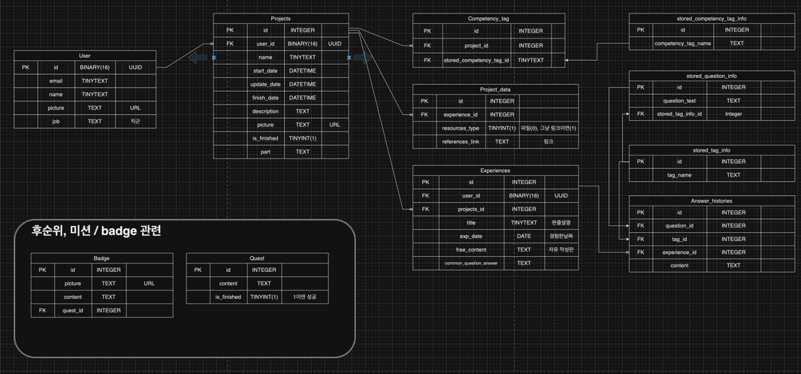

<div align="center">
<a id="readme-top"></a>
<!-- Header banner -->

<br><br>


<!-- Title Typing Effect -->
<a href="https://git.io/typing-svg"></a>
<br>
<br>

----

<p align="center">

  <a href="https://en.cppreference.com/w/" target="_blank">
    
  </a>
  <a href="https://isocpp.org/" target="_blank">
    
  </a>
  <a href="https://www.oracle.com/java/" target="_blank">
    
  </a>
  <a href="https://www.python.org/" target="_blank">
    
  </a>
  <a href="https://spring.io/projects/spring-boot/" target="_blank">
    
  </a>
</p>

<br>


</div>

<div>


<h3 align="center">Remember done, Record on!</h3>

  <p align="center">
    기억이 아닌 기록에 의한 경험을 담아보세요.!
        <br />
            <a href="https://github.com/Club-PARD/Record_ON_BE/blob/main/README.md"><strong>Explore the docs »</strong></a>
        <br />
    <br />
  </p>
</div>

---

<!-- 목차 -->
<details>
  <summary>목차</summary>
  <ol>
    <li><a href="#deployment-link">Deployment Link</a></li>
    <li>
      <a href="#service-iontroduction">Service Introduction</a>
      <ul>
        <li><a href="#goals-&-non-goals">Goals & Non-Goals</a></li>
      </ul>
    </li>
    <li>
      <a href="#functions">Functions</a>
      <ul>
        <li><a href="#record">Record</a></li>
        <li><a href="#view">View</a></li>
        <li><a href="#filtering">Filtering</a></li>
      </ul>
    </li>
    <li><a href="#erd">ERD</a></li>
    <li><a href="#commit-message-convention">Commit Message Convention</a></li>
    <li><a href="#branch-criteria">Branch Criteria</a></li>
    <li><a href="#stack">Stack</a></li>
    <li><a href="#contact">Contact</a></li>
    <li><a href="#acknowledgments">Acknowledgments</a></li>
  </ol>
</details>


## Deployment Link


<p align="right">(<a href="#readme-top">back to top</a>)</p>

<!-- ABOUT THE PROJECT -->
## Service Introduction

### 경험을 상세하게 기록하기 어려운 이들을 위한 ”경험 기록 서비스, RECORD ON”

> - 🧐 많은 대학생들은 **자신의 경험을 기록하는 방법을 몰라** 기억에 의존하거나 간단하게만 기록합니다.    
> - 😔 이로 인해, 취업 준비 단계에서 자기소개서 작성할 때 **필요한 내용을 충분히 담지 못하는 어려움**을 겪습니다.

### 💡 이러한 문제를 해결하기 위해,
> 1) 경험을 상세하게 기록할 수 있도록 도와주고 
> 2) 자기소개서 작성에 필요한 내용을 효과적으로 추출할 수 있는 서비스를 제공합니다.

<p align="right">(<a href="#readme-top">back to top</a>)</p>


### Goals & Non-Goals

## Goals
- 경험의 상세한 부분들까지 체계적으로 기록할 수 있도록 도와주는 것.
- 상세한 기록을 통해 자기소개서를 막힘없이 작성할 수 있도록 도와주는 것.

## Non-goals
- 단순히 자기소개서를 잘 작성하게 써주는 것.
- 전문 자기소개서 피드백을 해주는 것.

<p align="right">(<a href="#readme-top">back to top</a>)</p>


<!-- GETTING STARTED -->
## Functions

### Record
<aside>

###  🌿 1. 태그 및 질문 가이드라인을 통한 경험 기록 기능

> - **경험 태그와 질문을 제공하는 기능**
>    - 도전, 성공, 실패 등 다양한 경험 태그와 해당 태그에 맞는 구체적인 질문을 통해 경험을 자세히 기록할 수 있어요.
>- **답변 기록 및 작성 제한 기능**
>    - 질문에 답변을 기록하면 또 다른 태그와 질문을 선택할 수 있어요. 첫 태그와 질문에 답하지 않고 ‘자유란’만 작성하면 기록 완료 버튼이 비활성화돼요.
>- **경험 기록 저장 및 관리 기능**
>    - 작성한 경험 기록은 저장되고, 경험기록 페이지에서 모든 기록을 한눈에 모아볼 수 있어요. 이를 통해 자소서 작성에 필요한 자료를 쉽게 찾을 수 있어요.
</aside>

### View
<aside>

###  🌿 2. 기록들을 카드 형식으로 모아볼 수 있는 기능

> - **프로젝트 생성 기능**
>    - 프로젝트 이름, 한 줄 소개, 진행 기간, 역할, 선택 이유를 작성하면 프로젝트가 생성돼요. (*사진 첨부는 선택)
> - **프로젝트 카드 모음 기능**
>    - 프로젝트 카드에는 프로젝트명, 진행 기간, 핵심 역량 태그가 포함되며, 전체 카드들을 모아볼 수 있는 페이지가 있어요.
>- **프로젝트 내 경험기록 카드 모음 기능**
>    - 경험 기록 카드에는 소제목, 경험한 날짜, 경험 태그가 포함되며, 프로젝트 카드 내에서 경험기록 카드를 생성하고 모아볼 수 있어요.
>- **경험기록 작성 기능**
>    - 소제목, 경험한 날짜, 경험 태그 및 질문에 대한 답변을 작성할 수 있어요.
</aside>


### Filtering
<aside>

###  🌿 3. 태그 필터링 및 단어 검색 기능

> - 핵심 역량 태그 및 경험 태그 필터링 기능과 단어 검색 기능을 통해 빠르고 쉽게 필요한 기록을 찾을 수 있어요!
</aside>

<p align="right">(<a href="#readme-top">back to top</a>)</p>

## ERD



<p align="right">(<a href="#readme-top">back to top</a>)</p>

## Commit Message Convention

- By default, create a commit using the icon in https://gitmoji.dev/.

```
 < form >
{한다} {무엇을} {어떻게}
{세부 내용 설명}

 < ex >
:sparkles: Add login pages
:bug: Fix CORS Error
```
```
🚀 - Deploy stuff `:rocket:`

⚡ - Improve performance `:zap:`

🔥 - Remove code or files `:fire:`

🐛 - Fix a bug `:bug:`

✨ - Introduce new features `:sparkles:`

✅ - Add, Update `:white_check_mark:`

📝 - Add or update documentation `:memo:`

🙈 - Add or update ignore `:see_no_evil:`
```

<p align="right">(<a href="#readme-top">back to top</a>)</p>

## Branch Criteria


<p align="right">(<a href="#readme-top">back to top</a>)</p>

## Stack
### 🌟 Frontend(Web)

>Language : JavaScript
>Library & Framework : React, Styled-Components, Axios, Recoil, React-Quill, React-Rnd, React-To-Pdf
>Deploy: Netlify


### 💻 Backend

>Language : Java    
>Library & Framework : Spring Boot    
>Database : MySQLDB    
>ORM : JPA     
>Deploy: Mysql(Storage)    
>Infrastructure : AWS EC2, AWS S3, AWS IAM, AWS Route 53, AWS VPC

<p align="right">(<a href="#readme-top">back to top</a>)</p>

<!-- CONTACT -->
## Contact


<p align="right">(<a href="#readme-top">back to top</a>)</p>


<!-- ACKNOWLEDGMENTS -->
## Acknowledgments
* [Best-README-Template](https://github.com/othneildrew/Best-README-Template/tree/master)
* [GitHub Emoji Cheat Sheet](https://gitmoji.dev/)

<p align="right">(<a href="#readme-top">back to top</a>)</p>


<!-- MARKDOWN LINKS & IMAGES -->
<!-- https://www.markdownguide.org/basic-syntax/#reference-style-links -->
[forks-shield]: https://img.shields.io/github/forks/othneildrew/Best-README-Template.svg?style=for-the-badge
[forks-url]: https://github.com/othneildrew/Best-README-Template/network/members
[stars-shield]: https://img.shields.io/github/stars/othneildrew/Best-README-Template.svg?style=for-the-badge
[stars-url]: https://github.com/othneildrew/Best-README-Template/stargazers
[issues-shield]: https://img.shields.io/github/issues/othneildrew/Best-README-Template.svg?style=for-the-badge
[issues-url]: https://github.com/othneildrew/Best-README-Template/issues
[license-shield]: https://img.shields.io/github/license/othneildrew/Best-README-Template.svg?style=for-the-badge
[linkedin-shield]: https://img.shields.io/badge/-LinkedIn-black.svg?style=for-the-badge&logo=linkedin&colorB=555
[linkedin-url]: https://linkedin.com/in/othneildrew
[product-screenshot]: images/screenshot.png
[Next.js]: https://img.shields.io/badge/next.js-000000?style=for-the-badge&logo=nextdotjs&logoColor=white
[Next-url]: https://nextjs.org/
[React.js]: https://img.shields.io/badge/React-20232A?style=for-the-badge&logo=react&logoColor=61DAFB
[React-url]: https://reactjs.org/
[Vue.js]: https://img.shields.io/badge/Vue.js-35495E?style=for-the-badge&logo=vuedotjs&logoColor=4FC08D
[Vue-url]: https://vuejs.org/
[Angular.io]: https://img.shields.io/badge/Angular-DD0031?style=for-the-badge&logo=angular&logoColor=white
[Angular-url]: https://angular.io/
[Svelte.dev]: https://img.shields.io/badge/Svelte-4A4A55?style=for-the-badge&logo=svelte&logoColor=FF3E00
[Svelte-url]: https://svelte.dev/
[Laravel.com]: https://img.shields.io/badge/Laravel-FF2D20?style=for-the-badge&logo=laravel&logoColor=white
[Laravel-url]: https://laravel.com
[Bootstrap.com]: https://img.shields.io/badge/Bootstrap-563D7C?style=for-the-badge&logo=bootstrap&logoColor=white
[Bootstrap-url]: https://getbootstrap.com
[JQuery.com]: https://img.shields.io/badge/jQuery-0769AD?style=for-the-badge&logo=jquery&logoColor=white
[JQuery-url]: https://jquery.com

<br>
<!-- Footer banner -->


</div>